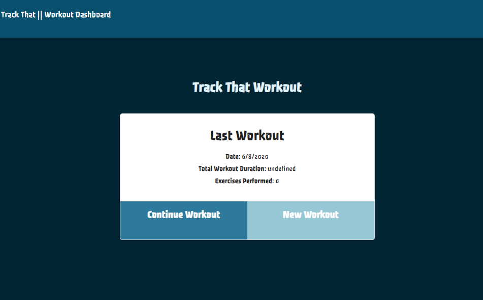
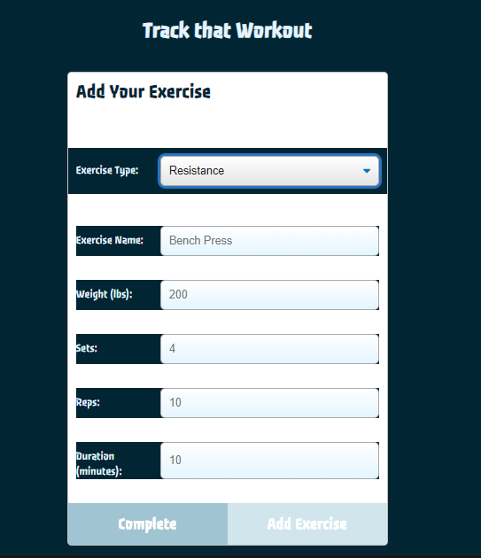
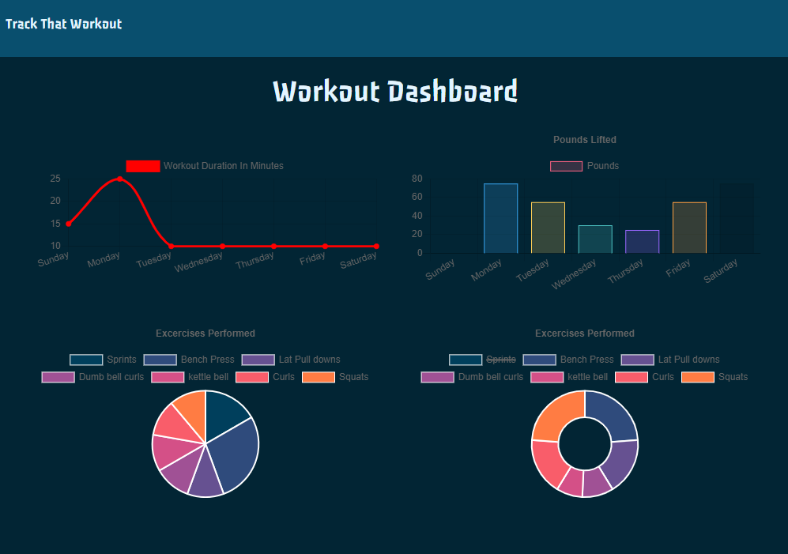
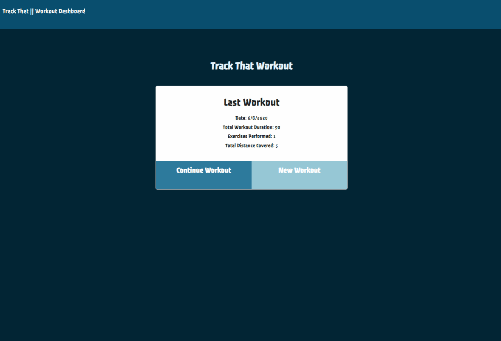

  <h1 align= "center">Track That: <a href="https://track-that-workout.herokuapp.com/" target="_blank">Live link</a></h1> 
  <h2>Table of Contents<h2>
  <ul>
  <li><a href="#descrip">Description</a></li>  
  <li><a href="#install">Installation</a></li> 
  <li><a href="#tech">Technology</a></li> 
  <li><a href="#use">Usage</a></li> 
  <li><a href="#license">License</a></li>
  <li><a href="#screen">Screenshots</a></li> 
  <li><a href="#tests">Tests</a></li>
  <li><a href="#quest">Questions</a></li>  
  </ul>
    

  
<h2>Description</h2> 

  Fitness tracker with Mongo
  

  
<h2>Installation</h2>

  

  

  
<h2>Technology</h2>
           
  
 HTML, CSS, APIs, JSON, Node.Js, Express, JavaScript, MongoDB, Heroku

  

  
<h2>Usage</h2>

  
Keep up with your workout routine
  
  

  
<h2>License</h2>

  

 
  

  
<h2>Screenshots</h2>

  

  

  
<h2>Tests</h2>

  

  

  
<h2>Questions?</h2> 

           
    Contact the Contributors: Annaruth McBride       
  <ul>
  <li>Github: <a href= "https://github.com/armcbride">https://github.com/armcbride</a></li>
  <li>Portfolio: <a href= "armcbride.github.io">armcbride.github.io</a></li>
  <li>Email: <a href= "mailto:armcbride17@gmail.com">armcbride17@gmail.com</a> </li>     
  <li>LinkedIn: <a href= "https://www.linkedin.com/in/annaruthmcbride">https://www.linkedin.com/in/annaruthmcbride</a></li>
  </ul> 
  
